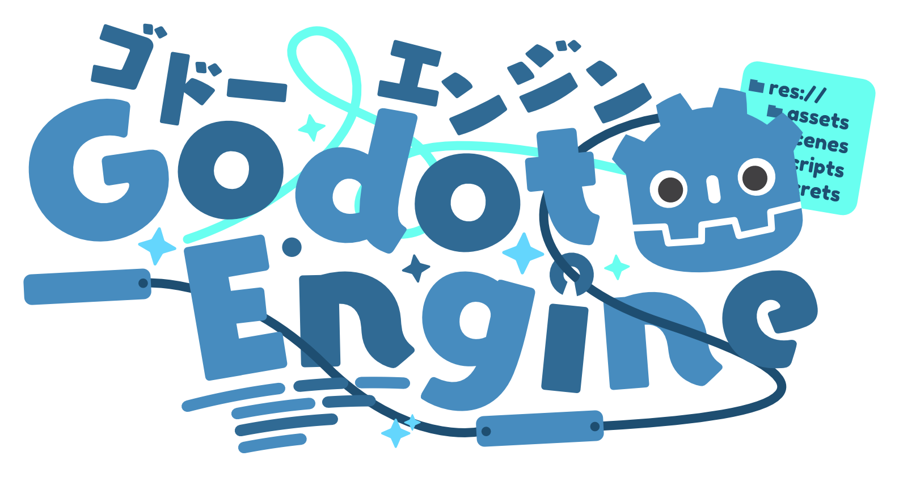

<div align="center">

[](README.md) [](README_CN.md) [](README_TW.md) [](README_RU.md) [](README_WY.md)


### 👋 Hello!!!

[](https://git.io/typing-svg)

🧑‍💻 **Developer** · 🎮 **Gamer** · 🎵 **Music Lover** · 🎹 **Music Creator**

---

### 🧰 My Skills

<table>
  <tr>
    <td valign="center" width="150"><b>Languages</b></td>
    <td valign="center"></td>
  </tr>
  <tr>
    <td valign="center" width="150"><b>Frameworks</b></td>
    <td valign="center"></td>
  </tr>
  <tr>
    <td valign="center" width="150"><b>Game Engine & IDEs</b></td>
    <td valign="center"></td>
  </tr>
  <tr>
    <td valign="center" width="150"><b>Databases</b></td>
    <td valign="center"></td>
  </tr>
  <tr>
    <td valign="center" width="150"><b>DevOps</b></td>
    <td valign="center"></td>
  </tr>
  <tr>
    <td valign="center" width="150"><b>Operating Systems</b></td>
    <td valign="center"></td>
  </tr>
</table>

#### ⭐ Favorites

<table>
  <tr>
    <td align="center"><a href="https://www.python.org"></a></td>
    <td align="center"><a href="https://www.java.com"></a></td>
    <td align="center"><a href="https://godotengine.org"></a></td>
  </tr>
  <tr>
    <td align="center"><a href="https://vuejs.org"></a></td>
    <td align="center"><a href="https://ubuntu.com"></a></td>
    <td align="center"><a href="https://archlinux.org"></a></td>
  </tr>
</table>

---

### 🐍 GitHub Contributions

<picture>
  <source media="(prefers-color-scheme: dark)" srcset="https://raw.githubusercontent.com/Abyss-PlayerEG/Abyss-PlayerEG/output/github-contribution-grid-snake-dark.svg">
  <source media="(prefers-color-scheme: light)" srcset="https://raw.githubusercontent.com/Abyss-PlayerEG/Abyss-PlayerEG/output/github-contribution-grid-snake.svg">
  
</picture>

---

### 📫 Contact

[](mailto:gaster@vip.playereg.top)
[](mailto:ender@vip.playereg.top)
[](https://github.com/Abyss-PlayerEG)
[](https://gitee.com/endergaster_geek)
[](https://blog.playereg.top)
[](https://space.bilibili.com/520500365)
[](https://steamcommunity.com/profiles/76561199212492626/)
[](https://steamcommunity.com/profiles/76561199756196216)

```text
⠀⠀⠀⠀⠀⠀⠀⠀⠀⠀⠀⠀⠀⠀⠀⠀⠀⠀⠀⠀⠀⠀⠀⠀⠀⠀⠀⠀⠀⠀⠀⠀⠀⠀⠀⠀⠀⠀⠀⠀⠀⠀⠻⠷⣦⣤⣀⡀⢀⡴⢢⡤⣄⡀⠀⠀⠀⠀⠀⠀⠀⠀⠀⠀⠀⠀⠀⠀⠀⠀⠀⠀⠀⠀⠀⠀⠀⠀⠀⠀⠀⠀⠀⠀⠀⠀⠀⠀⠀⠀⠀⠀⠀⠀⠀⠀⠀⠀
⠀⠀⠀⠀⠀⠀⠀⠀⠀⠀⠀⠀⠀⠀⠀⠀⠀⠀⠀⠀⠀⠀⠀⠀⠀⠀⠀⠀⠀⠀⠀⠀⠀⠀⠀⠀⠀⠀⠀⠀⠀⠀⠀⠀⠀⠈⠙⢻⡿⢿⣼⢰⣧⣿⡶⡆⠀⠀⠀⠀⠀⠀⠀⠀⠀⠀⠀⠀⠀⠀⠀⠀⠀⠀⠀⠀⠀⠀⠀⠀⠀⠀⠀⠀⠀⠀⠀⠀⠀⠀⠀⠀⠀⠀⠀⠀⠀⠀
⠀⠀⠀⠀⠀⠀⠀⠀⠀⠀⠀⠀⠀⠀⠀⠀⠀⠀⠀⠀⠀⠀⠀⠀⠀⠀⠀⠀⠀⠀⠀⠀⠀⠀⠀⠀⠀⠀⠀⠀⠀⠀⠀⠀⠀⠀⢠⠞⠀⠐⠌⠉⠉⠉⢡⣯⣤⣀⠀⠀⠀⠀⠀⠀⠀⠀⠀⠀⠀⠀⠀⠀⠀⠀⠀⠀⠀⠀⠀⠀⠀⠀⠀⠀⠀⠀⠀⠀⠀⠀⠀⠀⠀⠀⠀⠀⠀⠀
⠀⠀⠀⠀⠀⠀⠀⠀⠀⠀⠀⠀⠀⠀⠀⠀⠀⠀⠀⠀⠀⠀⠀⠀⠀⠀⠀⠀⠀⠀⠀⠀⠀⠀⠀⠀⠀⠀⠀⠀⢀⡠⡀⠀⠀⡠⠃⠀⠀⣴⠟⠓⠒⠋⠁⠀⠉⠙⠻⠷⣶⣤⣀⡀⠀⠀⠀⠀⠀⠀⠀⠀⠀⠀⠀⠀⠀⠀⠀⠀⠀⠀⠀⠀⠀⠀⠀⠀⠀⠀⠀⠀⠀⠀⠀⠀⠀⠀
⠀⠀⠀⠀⠀⠀⠀⠀⠀⠀⠀⠀⠀⠀⠀⠀⠀⠀⠀⠀⠀⠀⠀⠀⠀⠀⠀⠀⠀⠀⠀⠀⠀⠀⠀⠀⠀⠀⠀⢠⡏⠀⢰⠀⡴⠹⡄⠀⣼⠃⠀⠀⠀⠀⠀⠀⠀⠀⠀⠀⠀⠈⠉⠛⠷⢶⣤⣄⣀⠀⠀⠀⠀⠀⠀⠀⠀⠀⠀⡤⠤⢄⠀⠀⠀⠀⠀⠀⠀⠀⠀⠀⠀⠀⠀⠀⠀⠀
⠀⠀⠀⠀⠀⠀⠀⠀⠀⠀⠀⠀⠀⠀⠀⠀⠀⠀⠀⠀⠀⠀⠀⠀⠀⠀⠀⠀⠀⠀⠀⠀⠀⠀⠀⠀⠀⠀⢀⣺⣠⠊⢉⠻⣅⢣⠱⣼⠃⠀⠀⠀⠀⠀⠀⠀⠀⠀⠀⠀⠀⠀⠀⣀⠤⢤⡀⠉⠛⠻⠶⣦⣤⣀⠀⠀⠀⠀⠀⢱⢢⠘⡆⢀⢆⠀⠀⠀⠀⠀⠀⠀⠀⠀⠀⠀⠀⠀
⠀⠀⠀⠀⠀⠀⠀⠀⠀⠀⠀⠀⠀⠀⠀⠀⠀⠀⠀⠀⠀⠀⠀⠀⠀⠀⠀⠀⠀⠀⠀⠀⠀⠀⠀⠀⠀⢰⡏⠀⠃⠀⡘⡄⠈⠓⢧⡏⠀⠀⠀⢀⣀⠀⠀⠀⠀⠀⠀⠀⣠⢤⠞⠁⠀⠀⣿⠀⠀⠀⠀⠀⠉⠙⠛⠷⢶⣤⢀⡀⢧⢡⢇⠎⠊⡆⠀⠀⠀⠀⠀⠀⠀⠀⠀⠀⠀⠀
⠀⠀⠀⠀⠀⠀⠀⠀⠀⠀⠀⠀⠀⠀⠀⠀⠀⠀⠀⠀⠀⠀⠀⠀⠀⠀⠀⠀⠀⠀⠀⠀⠀⠀⠀⠀⠀⠘⡆⠀⠀⢸⣿⢿⡶⠄⠣⠬⠷⣤⣴⣟⡰⠉⢹⡄⠀⠀⢠⠞⡡⠚⣄⠆⠀⠀⡟⠀⠀⠀⠀⠀⠀⠀⠀⠀⠀⠈⠉⠓⠻⢼⢧⡤⠞⠀⠀⠀⠀⠀⠀⠀⠀⠀⠀⠀⠀⠀
⠀⠀⠀⠀⠀⣀⣠⣤⣤⣤⣤⣄⣀⠀⠀⠀⠀⠀⠀⠀⠀⠀⠀⠀⠀⠀⠀⠀⢀⡀⠀⢀⠠⠐⠂⢉⣩⠻⣾⡦⠈⢼⣟⣯⢿⣄⠀⠀⠇⠀⠙⣿⣷⣤⣾⣷⣴⠶⠏⢘⣴⣾⡟⠀⠀⠸⢣⠀⠀⠀⠀⠀⠀⠀⠀⠀⠀⠀⠀⠀⠀⠀⣾⠈⠻⣖⢢⡤⡀⠀⠀⠀⠀⠀⠀⠀⠀⠀
⠀⠀⢀⣴⠟⠛⠉⠛⠫⢿⣽⢯⡿⣿⣦⡀⠀⠀⠀⠀⠀⠀⠀⠀⠀⠀⢀⡆⢁⢔⡪⠔⠂⢩⣿⣥⢫⡙⢼⣧⠀⢘⣿⣾⣿⣿⣿⣿⣿⣶⣶⣼⣿⣿⣿⣿⠋⢀⣴⣿⢿⡽⣷⠀⠀⠀⢸⣾⣟⡿⣷⡄⠀⠀⠀⠀⠀⠀⠀⠀⠀⠠⣟⠀⠀⢨⠧⣗⡱⡀⠀⠀⠀⠀⠀⠀⠀⠀
⠀⣰⠟⠁⠀⠀⣠⣄⠀⠀⢻⡿⣽⢷⣻⢿⣦⠀⠀⠀⠀⠀⠀⠀⠀⡴⢹⠴⠋⠁⠀⢠⡾⢟⢲⢋⠖⡿⣯⣾⣷⣾⣿⣿⣿⣿⣿⣿⣿⣿⣿⣿⣿⣿⣿⣿⣦⣼⡿⣽⢯⣿⡟⠁⠱⢀⣾⣿⣿⣿⣽⠇⠀⠀⠀⠀⠀⠀⠀⠀⠀⠀⠈⠢⡀⢸⢣⣷⣡⠳⡀⠀⠀⠀⠀⠀⠀⠀
⢰⡏⠀⠀⠀⠀⠛⠛⠀⠀⠀⣿⣯⣟⣯⡿⣽⣇⠀⠀⠀⠀⠀⢀⠜⠊⣁⣴⡆⠠⣴⣾⢷⣾⣦⡏⡜⡰⣭⣿⣿⣿⣿⣿⣿⣿⣿⣿⣿⣿⣿⣿⣿⣿⣿⣿⣿⣿⣿⣯⡿⣽⠀⠀⢀⣾⣿⣿⣿⠙⠛⡄⠀⠀⠀⠀⠀⠀⠀⠀⠀⠀⠀⠀⢈⡞⡄⠤⠤⠞⠛⠀⣉⣉⣩⣍⣲⠄
⣿⠀⠀⠀⠀⠀⠀⠀⠀⢀⣼⣟⡷⣯⡷⣟⡿⣾⠀⠀⠀⡠⠚⠁⢠⣾⠟⠉⠀⠀⠀⣝⣻⣾⣽⣿⣎⣹⣿⢿⣿⣿⣿⣿⣿⣿⣿⣿⣿⣿⣿⣿⣿⣿⣿⣿⣿⣿⣿⣿⣽⠟⠀⠀⣼⣟⠾⠋⠋⠀⡀⢃⠀⠀⠀⠀⠀⠀⠀⠀⢀⣠⣤⠶⢛⣡⣶⣾⡟⠀⠀⠐⠛⠛⠋⣹⠏⠀
⣿⡀⠀⠀⠀⠀⢀⣴⣾⢿⣻⣞⣿⣳⢿⣻⣽⢿⠀⣠⠊⠀⠀⠀⠛⠁⠀⠀⠀⠀⠀⢻⣿⣻⣷⣯⣿⣿⣽⡿⠻⢿⣿⣿⣿⣿⣿⣿⣿⣿⣿⣿⣿⣿⣿⣿⣿⣿⣿⣿⠏⠀⢀⡼⠛⠁⠀⠀⠀⠀⡇⡜⢢⡀⠀⠀⢀⡠⢐⣼⣿⡏⠁⣀⠟⠉⠁⠀⠀⠀⠀⠀⠀⠀⣴⠋⠀⠀
⠸⣧⠀⠀⠀⠀⣾⣟⡾⣟⠗⢻⡾⣯⣟⡿⣾⠏⣼⣡⣶⡷⠀⠀⠀⠀⠀⠀⠀⠀⠀⢸⠿⢿⠚⢁⢀⣥⣮⡻⣦⣜⢿⣏⣀⡘⢿⣿⣿⣿⣿⡟⢻⣿⣿⣿⣿⣿⣿⣿⣀⣴⠿⡋⠟⠁⠀⣠⣴⠀⢃⡾⣶⣬⠒⠈⣁⣶⠿⠟⠋⠀⡔⠁⠀⠀⠀⠀⠀⠀⠀⠀⢀⣼⡁⠀⠀⠀
⠀⠙⣷⡀⠀⠀⢻⣯⣟⡿⣶⢾⣻⢷⣯⣿⠏⠀⡧⣿⠋⠀⠀⠀⠀⠀⠀⣠⣴⣤⣄⣸⡘⡹⠀⣀⠙⢍⣿⡛⠙⣿⡏⠈⠉⡿⠀⠀⠈⢼⣿⢻⣾⣿⣿⣿⣿⣿⣿⣿⢸⠗⠊⠀⠀⣰⡟⣧⡇⠀⡼⣱⢿⣹⡿⠋⠀⠀⠀⢀⡠⠊⠀⠀⠀⠀⠀⠀⠀⠀⠀⢠⡾⢡⢧⠀⠀⠀
⠀⠀⠈⠛⢷⣤⣀⡛⠾⣝⣯⣯⣽⡾⠟⠁⠀⠀⢱⡇⠀⠀⠀⠀⠀⠀⢸⣿⣿⣥⣬⡽⣷⣿⣿⣷⣾⣿⣿⣿⡶⣦⣧⡀⠙⠒⠢⠤⠀⣤⣬⣿⣿⣿⡃⠘⠛⣿⡟⠁⠀⢷⣤⣞⢦⣿⣺⡽⢀⣼⣿⡿⠚⠁⠀⠀⠀⣠⠔⠉⠀⠀⠀⠀⠀⠀⠀⠀⠀⢀⡴⢟⡌⠧⡞⠀⠀⠀
⠀⠀⠀⠀⠀⠀⠉⠙⠛⠛⠋⠉⠁⠀⠀⠀⠀⠀⠈⠶⡀⠀⠀⠀⠀⢠⣾⣿⣿⡟⠁⠀⠻⠉⡅⢉⣽⣿⣿⢭⣛⣿⡟⣷⣄⡀⠀⠀⠀⣠⣿⡿⢿⣿⣷⠈⣀⠧⣷⡀⠀⢸⣿⣜⢣⢿⣷⡿⣟⣿⣎⣿⠂⠀⣀⠔⠊⠀⠀⠀⠀⠀⠀⠀⠀⠀⠀⣠⠴⡏⠀⠈⢎⣵⠁⠀⠀⠀
⠀⠀⠀⠀⠀⠀⠀⠀⠀⠀⠀⠀⠀⠀⠀⠀⠀⠀⠀⠘⠵⡀⠀⠀⠀⢾⣿⣿⡟⠀⠀⢀⠃⠀⠑⠋⠉⠠⠚⢧⢋⡈⢿⣿⣿⣿⢻⣟⡻⣽⣾⣄⠸⣿⣿⣿⣿⣇⠹⠇⠀⠀⢏⠛⠞⢿⡻⣿⣿⣻⣟⡟⠐⠊⠀⠀⠀⣀⣀⣀⣀⡀⠤⠤⠔⠺⡉⠁⣰⠁⠀⢀⡴⢩⠀⠀⠀⠀
⠀⠀⠀⠀⠀⠀⠀⠀⠀⠀⠀⠀⠀⠀⠀⠀⠀⠀⠀⠀⠈⢳⡄⠀⠀⠈⠿⣿⣷⣀⠀⢸⠀⠀⡔⠂⣉⣥⣧⡼⢮⣵⣼⣿⣷⣾⣷⣿⣿⣿⣿⣿⡽⠼⠛⠑⠫⠿⣦⡀⠀⣠⣤⣥⠀⠀⣿⠈⠳⢿⡾⠉⠉⣿⣟⣿⣿⣧⠀⠀⠀⠀⠀⠀⠀⠀⢳⢠⠃⠀⡴⢋⠴⢩⠆⠀⠀⠀
⠀⠀⠀⠀⠀⠀⠀⠀⠀⠀⠀⠀⠀⠀⠀⠀⠀⠀⠀⠀⠀⠀⠙⢦⡀⠀⠀⠀⠉⠁⠀⠸⠀⠾⢤⣿⠟⣯⠥⣴⣾⣿⣿⣿⠿⢿⡿⠛⣿⣽⡟⠁⠀⠀⠀⠀⠀⣠⣾⣿⣷⣶⣟⠒⠒⠉⠀⠀⠀⠀⠀⠀⣰⣿⣾⣿⣿⠃⠀⠀⠀⠀⠀⣀⠤⠖⢊⡏⠀⠀⢸⠡⢮⠋⠀⠀⠀⠀
⠀⠀⠀⠀⠀⠀⠀⠀⠀⠀⠀⠀⠀⠀⠀⠀⠀⠀⠀⠀⠀⠀⠀⠀⠙⠦⡀⠀⠀⠀⠀⠸⠀⢠⣿⣿⣆⣯⣾⣿⣿⣿⣿⠁⠄⡆⢣⣵⣿⣿⢀⢴⠁⠀⣠⣴⡛⢿⣿⣿⣿⣿⣿⣷⣄⠀⠀⠀⠀⠀⢀⣼⣿⣿⣿⡿⠃⠀⠀⠀⠀⠀⡾⠀⠄⠀⣼⠁⠀⠀⡠⢿⠁⠀⠀⠀⠀⠀
⠀⠀⠀⠀⠀⠀⠀⠀⠀⠀⠀⠀⠀⠀⠀⠀⠀⠀⠀⠀⠀⠀⠀⠀⠀⠀⠈⠑⠢⠄⣀⡼⠀⣾⣿⣿⣻⢿⣽⣿⣿⣿⣇⠈⢼⠁⢸⣿⣟⣾⢐⡺⣦⠾⡙⡤⢭⣉⠞⡻⠿⢿⡻⠿⢿⡿⠶⣤⡴⣾⡿⠿⠿⠛⠉⠀⠀⠀⠀⠀⠀⢸⠁⣈⠴⠚⠁⠀⡴⢪⠑⠎⣣⠀⠀⠀⠀⠀
⠀⠀⠀⠀⠀⠀⠀⠀⠀⠀⠀⠀⠀⠀⠀⠀⠀⠀⠀⠀⠀⠀⠀⠀⠀⠀⠀⠀⠀⠀⠀⠀⣸⣿⣿⢾⣽⣻⡾⣽⡿⣿⣿⣿⣤⣤⣶⡿⣽⣻⣧⣵⡏⣖⢩⢖⠣⢎⡱⣡⣋⣾⣿⣾⣄⣳⣀⣿⡠⠤⣄⠀⠀⠀⠀⣠⡖⠒⡒⢒⣲⠟⠊⠁⠀⠀⠀⠀⢋⢇⡬⠊⠀⠀⠀⠀⠀⠀
⠀⠀⠀⠀⠀⠀⠀⠀⠀⠀⠀⠀⠀⠀⠀⠀⠀⠀⠀⠀⠀⠀⠀⠀⠀⠀⠀⠀⠀⠀⠀⣾⣿⢿⣻⡿⠉⣙⣻⣟⣿⣟⣻⢾⡿⣯⣷⣟⣯⣷⢿⣿⢲⣍⡚⣌⣣⣍⣒⣵⣿⣿⣿⣿⣿⡿⠟⢧⡐⣡⠂⡍⣲⢤⡚⡤⣇⡑⣨⠞⠁⠀⠀⠀⠀⢀⡤⢒⡭⡏⠀⠀⠀⠀⠀⠀⠀⠀
⠀⠀⠀⠀⠀⠀⠀⠀⠀⠀⠀⠀⠀⠀⠀⠀⠀⠀⠀⠀⠀⠀⠀⠀⠀⠀⠀⠀⠀⠀⠀⠘⠻⢯⣿⣟⠉⠀⠀⠀⠣⢐⣌⠉⠙⠷⣯⣛⣿⡾⣿⣧⠈⠉⠉⠁⠈⠙⠛⠛⠛⠛⠛⠋⠉⠀⠀⠀⠉⠒⠛⠉⠁⠀⠉⠉⠉⠉⠁⠀⠀⠀⠀⠀⢎⠱⢢⢁⠶⠃⠀⠀⠀⠀⠀⠀⠀⠀
⠀⠀⠀⠀⠀⠀⠀⠀⠀⠀⠀⠀⠀⠀⠀⠀⠀⠀⠀⠀⠀⠀⠀⠀⠀⠀⠀⠀⠀⠀⠀⠀⠀⠀⠈⢻⠀⠀⠀⠀⠀⠀⠈⠀⠀⠀⠈⢻⡯⠴⠾⠛⠀⠀⠀⠀⠀⠀⠀⠀⠀⠀⠀⠀⠀⠀⠀⠀⠀⠀⠀⠀⠀⠀⠀⠀⠀⠀⠀⠀⠀⠀⠀⠀⣈⡠⠖⠁⠀⠀⠀⠀⠀⠀⠀⠀⠀⠀
⠀⠀⠀⠀⠀⠀⠀⠀⠀⠀⠀⠀⠀⠀⠀⠀⠀⠀⠀⠀⠀⠀⠀⠀⠀⠀⠀⠀⠀⠀⠀⠀⠀⠀⠀⠸⡇⠀⠰⠀⠀⠀⠀⠀⠀⠀⠀⠘⢧⡀⠀⣰⣲⣄⠀⠀⠀⠀⠀⠀⠀⠀⠀⠀⠀⠀⠀⠀⠀⠀⠀⠀⠀⠀⠀⠀⠀⠀⠀⢠⠄⠒⠊⢉⡰⠀⠀⠀⠀⠀⠀⠀⠀⠀⠀⠀⠀⠀
⠀⠀⠀⠀⠀⠀⠀⠀⠀⠀⠀⠀⠀⠀⠀⠀⠀⠀⠀⠀⠀⠀⠀⠀⠀⠀⠀⠀⠀⠀⠀⠀⠀⠀⠀⢠⡇⠀⠀⢣⠀⠀⠀⠀⣀⣠⣶⣶⣶⣿⣶⣿⣟⣿⣆⠀⠀⠀⡀⢀⠀⠀⠀⠀⠀⠀⠀⠀⠀⠀⠀⠀⠀⠀⠀⠀⠀⠀⠀⡆⠀⣂⡬⠖⠁⠀⠀⠀⠀⠀⠀⠀⠀⠀⠀⠀⠀⠀
⠀⠀⠀⠀⠀⠀⠀⠀⠀⠀⠀⠀⠀⠀⠀⠀⠀⠀⠀⠀⠀⠀⠀⠀⠀⠀⠀⠀⠀⠀⠀⠀⠀⠀⠀⢸⡁⠀⠀⣈⣥⣴⣾⢿⣻⣿⣿⣽⣻⣽⢿⣿⣿⢿⣾⣶⣿⣟⣿⣿⡍⣷⣄⢶⡟⡹⣦⠀⠀⠀⠀⠀⠀⠀⡠⠤⠐⠒⣺⠿⠿⠿⠶⠦⣤⣀⠀⠀⠀⠀⠀⠀⠀⠀⠀⠀⠀⠀
⠀⠀⠀⠀⠀⠀⠀⠀⠀⠀⠀⠀⠀⠀⠀⠀⠀⠀⠀⠀⠀⠀⠀⠀⠀⠀⠀⠀⠀⠀⠀⠀⠀⠀⠀⢹⣾⣶⡿⣿⣻⡽⣯⣿⣿⣿⣯⣷⣿⣽⣿⣿⡍⢉⣉⣩⠴⠂⠑⠈⣹⣭⡍⢳⢌⣱⣹⡇⠀⠀⠀⠀⠀⢰⣁⣀⣀⡜⠁⠀⠀⠀⠀⠀⠀⠉⠻⣦⡀⠀⠀⠀⠀⠀⠀⠀⠀⠀
⠀⠀⠀⠀⠀⠀⠀⠀⠀⠀⠀⠀⠀⠀⠀⠀⠀⠀⠀⠀⠀⠀⠀⠀⠀⠀⠀⠀⠀⠀⢀⣀⣀⣀⠀⢸⢻⣯⣿⣷⣿⣻⢯⣷⣟⣾⣯⣟⣿⣿⣿⢾⣇⠇⠀⠀⠀⠀⢠⣾⠿⣽⢃⣏⠖⢹⡰⣿⠀⠀⠀⠀⠀⣴⠏⠁⠀⠀⠀⠀⠀⠀⠀⠀⠀⠀⠀⠈⢷⡀⠀⠀⠀⠀⠀⠀⠀⠀
⠀⠀⠀⠀⠀⠀⠀⠀⠀⠀⠀⠀⠀⠀⠀⠀⠀⠀⠀⠀⠀⠀⠀⠀⠀⢀⣠⣒⣈⣉⣹⣿⣻⣟⣿⡿⣟⣟⡷⠿⣾⡽⣯⢿⠿⢟⣾⣽⢾⣻⣽⣻⣿⡀⠀⢀⣀⢀⡿⣽⣻⡵⠗⢁⠀⡞⡥⣿⠀⠀⠀⠀⢸⣏⣴⣿⢿⡿⣿⣦⡀⠀⠀⠀⣠⣤⡀⠀⢸⣷⠀⠀⠀⠀⠀⠀⠀⠀
⠀⠀⠀⠀⠀⠀⠀⠀⠀⠀⠀⠀⠀⠀⠀⠀⠀⠀⠀⠀⠀⠀⠀⢀⣴⣿⠿⠿⠿⠿⢯⣷⣿⣮⣉⣻⣯⣶⠿⡿⡽⣿⣽⣿⣶⡶⣤⣩⣿⢯⣷⣟⣿⡗⡀⠱⣎⣼⣿⣿⣿⣤⠘⡆⣜⠳⣐⢻⡆⠀⠀⠀⣿⣿⣟⡾⣯⣟⣷⣻⢿⠀⠀⠀⠘⠋⠀⠀⣼⣿⠆⠀⠀⠀⠀⠀⠀⠀
⠀⠀⠀⠀⠀⠀⠀⠀⠀⠀⠀⠀⠀⠀⠀⠀⠀⠀⠀⠀⠀⣠⡴⠋⠡⣀⡤⠤⠤⠤⢄⣀⠀⢉⡹⠍⠁⠀⠀⠀⠀⠀⠀⠀⠉⠙⠻⠿⣽⣯⣧⣬⣹⡇⢰⢠⠏⠘⣿⣿⣿⣿⡭⣙⡦⢓⣬⡽⠀⠀⠀⠀⢻⡷⣯⢿⣄⣸⣯⣟⡿⣷⣄⣀⣀⣀⣤⣾⡿⣽⠀⠀⠀⠀⠀⠀⠀⠀
⠀⠀⠀⠀⠀⠀⠀⠀⠀⠀⠀⠀⠀⠀⠀⠀⠀⠀⠀⠀⡼⠛⣄⠞⠉⠀⠀⠀⠀⠀⢀⠜⣱⣥⡶⣶⢶⡶⣤⣤⣄⡀⠀⠀⠀⠀⠀⠈⠲⣈⡉⠙⠛⢁⣸⠋⡀⠀⢹⣿⣿⡿⠵⠾⠵⠛⡵⠃⠀⠀⠀⠀⠈⢿⣽⣯⢿⡽⣾⣽⣻⢷⣻⣟⡿⣯⣟⣷⣻⠇⠀⠀⠀⠀⠀⠀⠀⠀
⠀⠀⠀⠀⠀⠀⠀⠀⠀⠀⠀⠀⠀⠀⠀⠀⢀⣠⡤⠴⢷⡾⢍⡀⠀⠐⡄⢢⢀⠀⣾⢿⣯⢷⣻⡽⣯⠽⠛⠚⠻⣇⣀⣀⣀⣀⣀⡠⠔⢊⣻⠶⠖⠛⠉⠀⡱⠀⠀⣿⣿⡜⡄⢣⡬⠟⠁⠀⠀⠀⠀⠀⠀⠈⠻⣾⣯⢟⣷⣫⢟⣯⢷⢯⣟⢷⣻⡾⠋⠀⠀⠀⠀⠀⠀⠀⠀⠀
⠀⠀⠀⠀⠀⠀⠀⠀⠀⠀⠀⠀⠀⠀⠀⠀⠈⢿⣯⡱⢆⡹⡗⠃⠀⠀⠈⠉⠁⠀⠈⠻⣞⠯⣷⣹⠋⠀⠀⠀⠀⠀⠀⠀⠈⠀⠀⠀⣠⠟⠁⠀⠀⠀⢀⡼⠦⠀⣠⣿⣿⣿⣿⠋⠀⠀⠀⠀⠀⠀⠀⠀⠀⠀⠀⠈⠛⠿⣶⣭⣿⣜⣯⣾⡾⠟⠋⠀⠀⠀⠀⠀⠀⠀⠀⠀⠀⠀
⠀⠀⠀⠀⠀⠀⠀⠀⠀⠀⠀⠀⠀⠀⠀⠀⠀⠀⠙⠹⢦⣷⠸⠶⢤⣄⣀⣀⣀⣀⠤⡚⣥⡾⣿⠁⠀⠀⠀⠀⠀⠀⠀⠀⠀⠀⡠⠞⠁⠒⢄⠀⠀⣠⡚⣷⠾⠿⠛⣿⣿⣿⣿⡆⠀⠀⠀⠀⠀⠀⠀⠀⠀⠀⠀⠀⠀⠀⠀⠈⠉⠉⠉⠀⠀⠀⠀⠀⠀⠀⠀⠀⠀⠀⠀⠀⠀⠀
⠀⠀⠀⠀⠀⠀⠀⠀⠀⠀⠀⠀⠀⠀⠀⠀⠀⠀⠀⠀⠺⡪⣝⢖⡻⡐⢦⡑⢎⠴⣩⣿⡝⣾⠇⠀⠀⠀⠀⠀⠀⠀⠀⢀⡴⠋⠀⠀⠀⠀⠀⣷⣾⣿⣿⣿⣄⣀⣰⣿⣿⣿⣿⠇⠀⠀⠀⠀⠀⠀⠀⠀⠀⠀⠀⠀⠀⠀⠀⠀⠀⠀⠀⠀⠀⠀⠀⠀⠀⠀⠀⠀⠀⠀⠀⠀⠀⠀
⠀⠀⠀⠀⠀⠀⠀⠀⠀⠀⠀⠀⠀⠀⠀⠀⠀⠀⠀⠀⠀⠈⠊⠝⣒⠭⠦⡹⢜⢫⠵⣺⡝⣾⠀⠀⠀⠀⠀⠀⠀⢀⣴⠏⠀⠀⠀⠀⠀⢀⣼⣿⣛⢿⣿⣿⣿⣿⣿⣿⣿⣿⡿⠀⠀⠀⠀⠀⠀⠀⠀⠀⠀⠀⠀⠀⠀⠀⠀⠀⠀⠀⠀⠀⠀⠀⠀⠀⠀⠀⠀⠀⠀⠀⠀⠀⠀⠀
⠀⠀⠀⠀⠀⠀⠀⠀⠀⠀⠀⠀⠀⠀⠀⠀⠀⠀⠀⠀⠀⠀⠀⠀⠀⠈⠉⠑⠰⠦⠤⡷⣹⠇⠀⠀⠀⠀⠀⠀⠀⣾⠁⠀⠀⠀⠀⣠⡴⢿⡟⢦⡍⣾⣿⣿⣿⣿⣿⣿⡿⠟⠁⠀⠀⠀⠀⠀⠀⠀⠀⠀⠀⠀⠀⠀⠀⠀⠀⠀⠀⠀⠀⠀⠀⠀⠀⠀⠀⠀⠀⠀⠀⠀⠀⠀⠀⠀
⠀⠀⠀⠀⠀⠀⠀⠀⠀⠀⠀⠀⠀⠀⠀⠀⠀⠀⠀⠀⠀⠀⠀⠀⠀⠀⠀⠀⠀⠀⠀⣟⠏⠀⠀⠀⠀⠀⠀⠀⠀⠀⠀⠀⢀⣤⡾⠋⠀⠀⠹⣿⣿⣿⣿⣿⠏⠀⠀⠀⠀⠀⠀⠀⠀⠀⠀⠀⠀⠀⠀⠀⠀⠀⠀⠀⠀⠀⠀⠀⠀⠀⠀⠀⠀⠀⠀⠀⠀⠀⠀⠀⠀⠀⠀⠀⠀⠀
⠀⠀⠀⠀⠀⠀⠀⠀⠀⠀⠀⠀⠀⠀⠀⠀⠀⠀⠀⠀⠀⠀⠀⠀⠀⠀⠀⠀⠀⠀⠀⣿⡄⠀⠀⠀⠂⠁⠀⠀⣀⣠⣤⣶⡿⠏⠁⠀⠀⠀⠀⠀⠉⠉⠉⠀⠀⠀⠀⠀⠀⠀⠀⠀⠀⠀⠀⠀⠀⠀⠀⠀⠀⠀⠀⠀⠀⠀⠀⠀⠀⠀⠀⠀⠀⠀⠀⠀⠀⠀⠀⠀⠀⠀⠀⠀⠀⠀
⠀⠀⠀⠀⠀⠀⠀⠀⠀⠀⠀⠀⠀⠀⠀⠀⠀⠀⠀⠀⠀⠀⠀⠀⠀⠀⠀⠀⠀⠀⢸⣧⢻⡶⣄⣀⣀⣤⡾⣟⠿⣭⡷⠋⠀⠀⠀⠀⠀⠀⠀⠀⠀⠀⠀⠀⠀⠀⠀⠀⠀⠀⠀⠀⠀⠀⠀⠀⠀⠀⠀⠀⠀⠀⠀⠀⠀⠀⠀⠀⠀⠀⠀⠀⠀⠀⠀⠀⠀⠀⠀⠀⠀⠀⠀⠀⠀⠀
⠀⠀⠀⠀⠀⠀⠀⠀⠀⠀⠀⠀⠀⠀⠀⠀⠀⠀⠀⠀⠀⠀⠀⠀⠀⠀⠀⠀⠀⠀⠀⠻⣧⢻⡝⢯⡻⣜⡧⠟⠋⠁⠀⠀⠀⠀⠀⠀⠀⠀⠀⠀⠀⠀⠀⠀⠀⠀⠀⠀⠀⠀⠀⠀⠀⠀⠀⠀⠀⠀⠀⠀⠀⠀⠀⠀⠀⠀⠀⠀⠀⠀⠀⠀⠀⠀⠀⠀⠀⠀⠀⠀⠀⠀⠀⠀⠀⠀
⠀⠀⠀⠀⠀⠀⠀⠀⠀⠀⠀⠀⠀⠀⠀⠀⠀⠀⠀⠀⠀⠀⠀⠀⠀⠀⠀⠀⠀⠀⠀⠀⠀⠉⠉⠉⠉⠁⠀⠀⠀⠀⠀⠀⠀⠀⠀⠀⠀⠀⠀⠀⠀⠀⠀⠀⠀⠀⠀⠀⠀⠀⠀⠀⠀⠀⠀⠀⠀⠀⠀⠀⠀⠀⠀⠀⠀⠀⠀⠀⠀⠀⠀⠀⠀⠀⠀⠀⠀⠀⠀⠀⠀⠀⠀⠀⠀⠀
```


</div>
